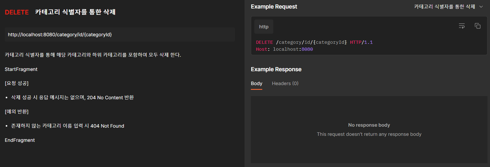

# Hanteo CodingTest

트리구조 카테고리를 추가,삭제,검색 기능을 지원 합니다. 또한 결과는 JSON 형태로 반환 되며, 각 API에 대한 예외 처리에 따른
예외 코드가 정해져 있습니다. ReadMe에 포함된 이미지 또는 아래의 API URL를 참고 해주세요.
- API URL :  https://documenter.getpostman.com/view/25401186/2s93zCZ1ZZ

1. 카테고리 추가

<p align = "center">

</p>

2. 카테고리 검색(이름)
<p align = "center">

</p>

3. 카테고리 검색(식별자)
<p align = "center">

</p>

4. 카테고리 전체 검색
<p align = "center">

</p>

5. 카테고리 전체 검색
<p align = "center">

</p>

6. 카테고리 삭제(이름)
<p align = "center">

</p>

7. 카테고리 삭제(식별자)
<p align = "center">

</p>

[요구 상황에 대한 JSON 응답 예시]
```JSON
{
  "id": "0",
  "parentIdx": -1,
  "name": "카테고리",
  "categoryNodes": [
    {
      "id": "a0",
      "parentIdx": 0,
      "name": "남자",
      "categoryNodes": [
        {
          "id": "b0",
          "parentIdx": 0,
          "name": "엑소",
          "categoryNodes": [
            {
              "id": "c1",
              "parentIdx": 0,
              "name": "공지사항",
              "categoryNodes": []
            },
            {
              "id": "c2",
              "parentIdx": 0,
              "name": "챈",
              "categoryNodes": []
            },
            {
              "id": "c3",
              "parentIdx": 0,
              "name": "백현",
              "categoryNodes": []
            },
            {
              "id": "c4",
              "parentIdx": 0,
              "name": "시우민",
              "categoryNodes": []
            }
          ]
        },
        {
          "id": "b1",
          "parentIdx": 0,
          "name": "방탄소년단",
          "categoryNodes": [
            {
              "id": "c5",
              "parentIdx": 1,
              "name": "공지사항",
              "categoryNodes": []
            },
            {
              "id": "c6",
              "parentIdx": 1,
              "name": "익명게시판",
              "categoryNodes": []
            },
            {
              "id": "c7",
              "parentIdx": 1,
              "name": "뷔",
              "categoryNodes": []
            }
          ]
        }
      ]
    },
    {
      "id": "a1",
      "parentIdx": 0,
      "name": "여자",
      "categoryNodes": [
        {
          "id": "b2",
          "parentIdx": 1,
          "name": "블랙핑크",
          "categoryNodes": [
            {
              "id": "c8",
              "parentIdx": 2,
              "name": "공지사항",
              "categoryNodes": []
            },
            {
              "id": "c6",
              "parentIdx": 2,
              "name": "익명게시판",
              "categoryNodes": []
            },
            {
              "id": "c10",
              "parentIdx": 2,
              "name": "로제",
              "categoryNodes": []
            }
          ]
        }
      ]
    }
  ]
}
```

``` GRADLE
dependencies {
    implementation 'org.springframework.boot:spring-boot-starter-thymeleaf'
    implementation 'org.springframework.boot:spring-boot-starter-web'
    compileOnly 'org.projectlombok:lombok'
    developmentOnly 'org.springframework.boot:spring-boot-devtools'
    annotationProcessor 'org.projectlombok:lombok'
    testImplementation 'org.springframework.boot:spring-boot-starter-test'
    implementation 'com.fasterxml.jackson.core:jackson-databind:2.12.5'

}